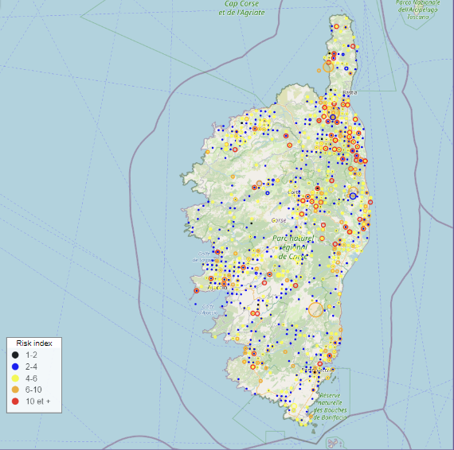
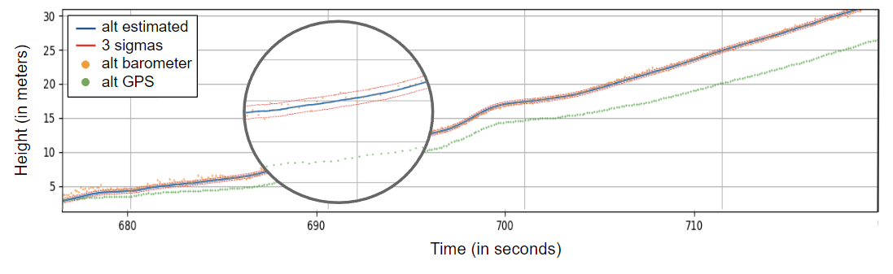
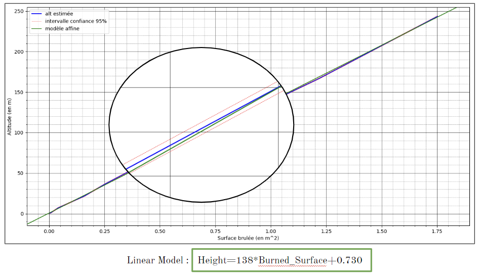
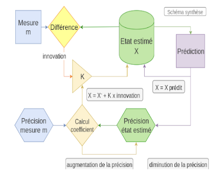
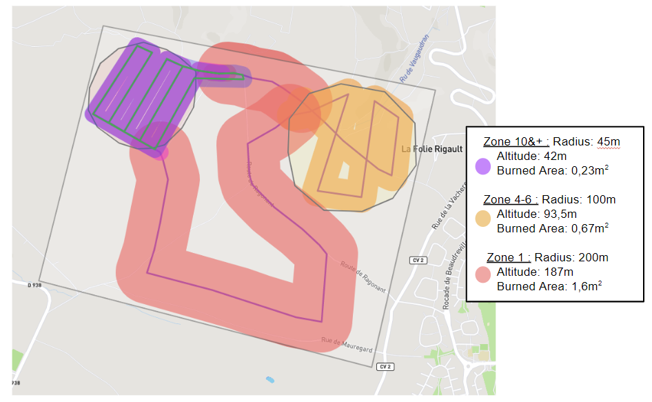

Wildfires threaten the lives of thousands of humans each year. This led us to ponder on 
# How to prevent the development of fires using drones?

## I. Drones: Preventing Forest Fires

Climate change brings about an increase in natural disasters, notably forest fires. These fires jeopardize the lives of populations near forests and the well-being of all living beings and available resources.

Predicting the occurrence of forest fires is challenging. To limit their spread, we aim to detect them quickly through territorial surveillance. Current surveillance methods have their advantages and disadvantages, but drones emerge as the most effective tool. Hence, we decided to make it our surveillance means, but automation is essential.

To make the drone autonomous in surveillance, it needs autonomous movements:
* A predefined flight plan
* Predefined altitude management
We will address each of these requirements separately.

## II. Flight Plan

The flight plan must adapt to each environment, considering the terrain's topography provided by maps and areas with a particularly high risk of fire. To evaluate the fire risk, we use the historical data of forest fires in the south of France since 1973. We will adopt this method to define a risk index in each zone.

After consulting global wildfire risk assessment models, we chose three risk indices:
* FFMC = Fine Fuel Moisture Code
* ISI = Initial Spread Index
* BS = Burned Surfaces

After adjustments based on data and literature, we have define a global index : 
>GI = a*FFMC + b*ISI + c*BS**(1/2)
>with a=0.011, b=0,000297, c=0,000063

This index is seetling between 0 and 15 mainely and is an evaluation of the dangerousity of a place. The coefficient are choosen to set both FFMC, ISI and BS between 0 and 5 and so to give all of them the same impact on the final global index GI. Tests based on a large amount of data are needed to adjust coefficient a, b, and c. 

GI appears to be a good indicator of the risk a wildfire to appear.

## III. Altitude

Now that we know which areas to monitor, we need to choose the height at which the drone should position itself. The higher the drone, the less precise the ground surface can be observed, especially with a camera without optical zoom. We decided to use a generalized drone camera model capable of filming in HD. Our experiment aimed to determine a relationship between surveillance height and the area engulfed in flames, symbolized by cardboard cutouts.

Using different-sized cardboard cutouts, we noted the heights from which the cutout appeared smaller than a certain number of pixels. By correlating this with the drone's flight data, we could determine the drone's altitude at the moment of the video image. This allowed us to create a graph, which initially seemed linear. However, discrepancies raised concerns, leading to discussions with engineers from Azure Drone, who highlighted uncertainties in drone position.

Using the Kalman Filter to merge data from various onboard sensors, we obtained a more accurate altitude estimation, with a 95% confidence interval of around 0.8m. We can model this curve as an almost consistently linear line, closely approaching the origin.

## IV. Final Surveillance Model

In conclusion, we can determine the drone's path and altitude for monitoring a territory and potentially detecting a fire. We have defined surveillance methods for each risk index, which remain subjective and must be adjusted through numerous experiments. We initiated the validation of our model with a first test flight in fields, surveilling a 2.6 km^2 area and defining zones with risk indices. The drone followed predefined paths, providing comprehensive surveillance of the considered territory.

## V. Financial Evaluation for Forest Surveillance in Corsica

In order to establish a robust forest surveillance system in Corsica, we have conducted a financial evaluation based on the current characteristics of professional drones and the geographical dimensions of the region.

Current Characteristics of Professional Drones:

* Average speed: 25 km/h
* Autonomy: 25 minutes
* Annual cost of drone surveillance service: €150,000

Corsican Geographical Dimensions:

* Total forest area: 5,500 km²
* Area classified as Zone 10&+: 2,176 km²
* Area classified as Zone 6 to 10: 60.47 km²
(...and other specified zones)

Total Number of Drones Required: 1374
Total Cost: €206.1 million per year

Note: The annual budget allocated for fire surveillance in Corsica is €50 million.

This financial evaluation considers the deployment of 1374 professional drones to cover the extensive forested areas efficiently. The calculation takes into account the average speed, autonomy, and annual cost of each drone, resulting in a comprehensive budget of €206.1 million per year. It's essential to note that this estimate exceeds the current annual budget for fire surveillance in Corsica, which stands at €50 million. Further discussions and adjustments may be necessary to align the financial strategy with the desired level of surveillance coverage and budget constraints.

## Conclusion

Parameters may need adjustment after further experimentation to reduce the necessary budget. These parameters must be chosen following rigorous testing.

In conclusion, we have a comprehensive surveillance model achievable with the new surveillance tool - drones. These drones can incorporate various technologies at a relatively low cost.

## Bibliographic References

1. Inria de Paris: [BurnMonitor IoT Detection of Forest Fires](https://www.inria.fr/fr/burnmonitor-iot-detection-feux-foret)
2. Bzorg: [How a Kalman Filter Works in Pictures](http://www.bzarg.com/p/how-a-kalman-filter-works-in-pictures/)
3. Azur Drone: Corporate library
4. Prométhée: [Prométhée - Forest Fires Database](https://www.promethee.com/default/incendies)
5. Élise FOULATIER: [Simulation de la propagation d'un feu de forêt (PDF)](https://eduscol.education.fr/sti/sites/eduscol.education.fr.sti/files/ressources/pedagogiques/13640/13640)
